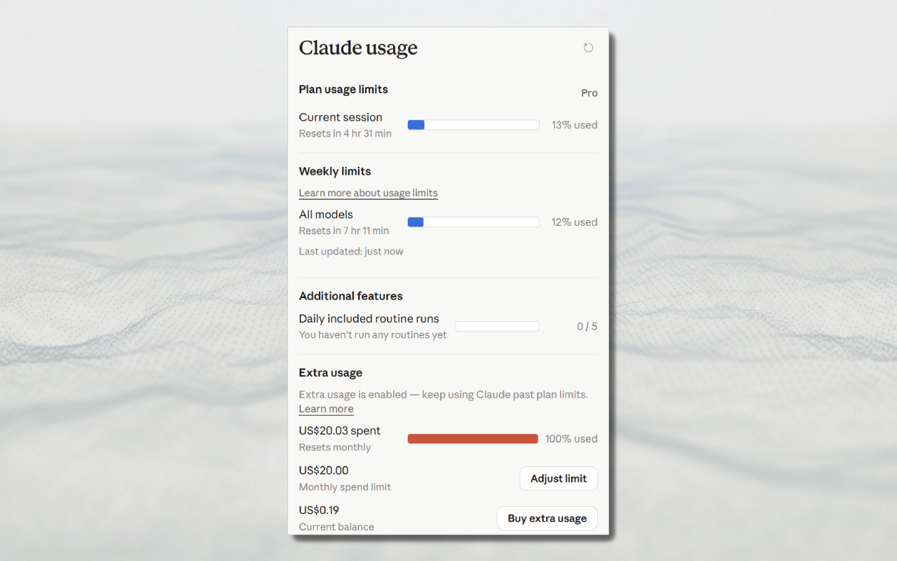

# Claude Usage Meter

A small Chrome / Edge extension that shows how much of your Claude
subscription you've used. The toolbar icon shows the current 5-hour
session percentage as a badge, and clicking it opens a popup with the
full breakdown (current session, weekly all-models, daily routine runs,
extra usage) styled like Claude's own settings page.

## Install (developer mode)

1. Open `chrome://extensions` (or `edge://extensions` for Edge).
2. Toggle **Developer mode** on (top-right).
3. Click **Load unpacked** and select this folder
   (`claude-usage-extension`).
4. Make sure you're signed in to <https://claude.ai>. The extension
   re-uses your normal browser session — there is no token to paste in.

The extension refreshes the data every 5 minutes (and on browser
startup); you can also click the refresh icon in the popup to force a
re-fetch.

## What the badge means

The number on the toolbar icon is the **current 5-hour session
utilization** as reported by `/api/organizations/{id}/usage`.
Color shifts:

- Blue: under 70%
- Amber: 70–89%
- Red: 90% and above
- `!`: not logged in / fetch failed
